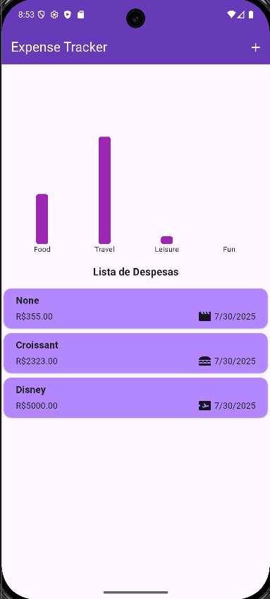

# Expense Tracker

## 🇧🇷 Em Português

O **Expense Tracker** é um projeto desenvolvido com o objetivo de praticar conceitos fundamentais do desenvolvimento de aplicações mobile utilizando **Flutter**. O foco está em aplicar e compreender o uso de widgets essenciais e frequentemente utilizados em praticamente qualquer aplicação Flutter, como:

- `ListView`
- `Dismissible`
- `AppBar`

Além dos widgets nativos, também foi integrada a biblioteca externa [`fl_chart`](https://pub.dev/packages/fl_chart), permitindo uma **visualização gráfica clara e intuitiva** dos gastos. Essa funcionalidade ajuda o usuário a identificar, de forma proporcional, **quais categorias concentram os maiores gastos**.

Este projeto é ideal para quem está começando no Flutter e deseja entender como manipular listas, excluir itens, organizar o layout com AppBar e integrar gráficos simples ao app.

---

## 🇺🇸 In English

**Expense Tracker** is a project built with the goal of practicing essential concepts in **Flutter mobile app development**. It focuses on implementing and understanding core widgets that are widely used in almost every Flutter application, such as:

- `ListView`
- `Dismissible`
- `AppBar`

In addition to the native widgets, the project integrates the external library [`fl_chart`](https://pub.dev/packages/fl_chart), which enables a **clean and intuitive graphical representation** of user expenses. This feature allows users to easily visualize **which categories account for their highest expenses**.

This project is perfect for beginners looking to learn how to handle lists, delete items, structure layouts with AppBar, and add basic chart visualizations to a Flutter app.

## HomePage and Aesthetics of the App

  

